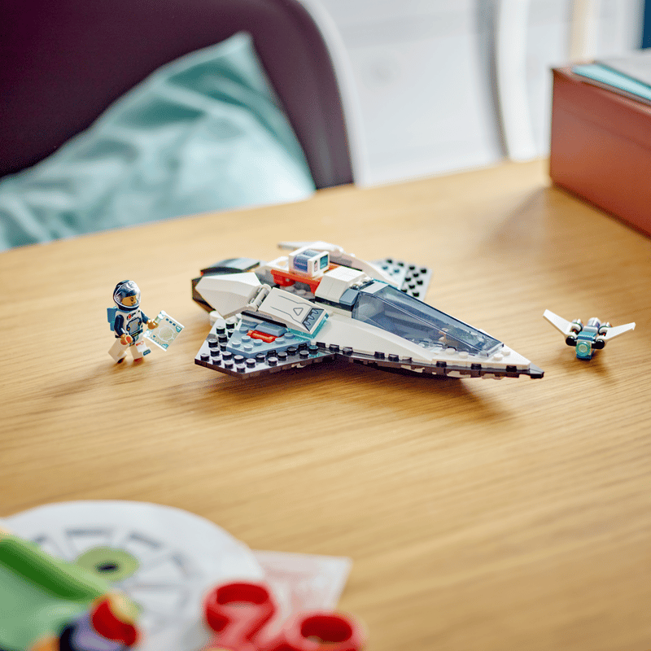

# Design Patterns Through the Lens of LEGO

## Every Great Build Begins with a Single Brick

Web development is like building LEGO bricks. You start from the bottom up, one side to the other, and you might even get a newly-discovered block if you twist it hard enough. Every LEGO box comes with its own imagination. When learning to build with LEGOS, it would be best to have a tool for knowing where things are and as you do more of them (building with LEGOS) then you have created a general log in your mind. It's through creational patterns that get us out of the comfort zone and take on new challenges. It's the reason we configure a database connection so we can see the schemas that we can twist it with.
Likewise, it's the part of our brain that lets us know that object permanence means something stays even though we try to hide it so we establish personal patterns.

## When the Pieces Finally Click

Let's go back to the LEGO example. What happens if we make a part of let's say a spaceship, and it seems different from the desired look of the model. You tried to build the wing of the spaceship but now when you turn it around 90 degrees, 180, sideways, upwards, down there, you might see somewhere where it went wrong. This is good because we are learning structure so that the next time we tackle a new LEGO set, we have a mental model of how to put the pieces together to match perfectly with the box image. With structural patterns, we are linking new data to our mental model that says, in this area of building LEGOS, we do / don't do this.

## Building Together, One Conversation at a Time

Since LEGOS don't communicate with each other, someone building them needs to cooperate and interact actively with each other. What about if you were in the LEGO Club for your school? Both of you are tasked with building out a creative LEGO bridge that looks alluring. You don't want it where both of you just create something without communicating. No, communication is key. If they have a block that you need, maybe they have it. Sharing ideas? Cool, explain it because maybe it's better than the other person's idea. This also builds up on how you approach building with LEGOS from now on because you are getting better at behavioral patterns. You can become more efficient at working in a team by knowing ahead of time what your teammate wants and then you are able give it to them like an event listener in web development.
