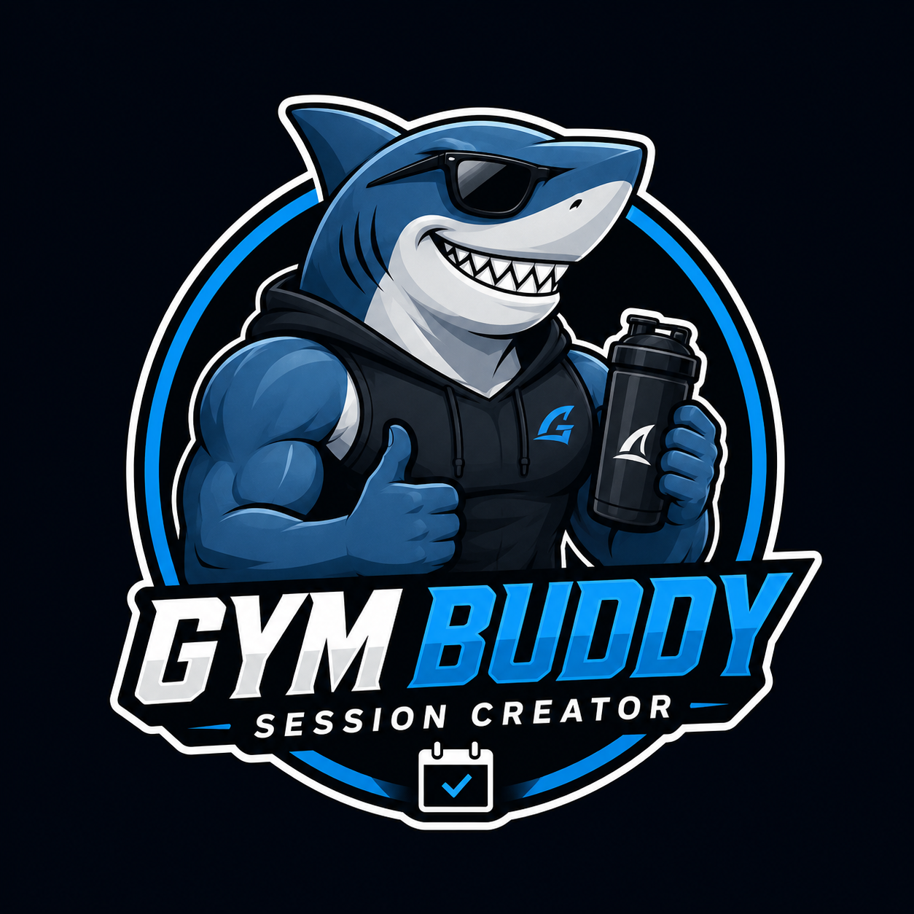

# Find a gym buddy near you

## Overview

_Problem:_ As a UH Mānoa computer-oriented student, it's a given that we constantly have to shift between doing work, spending time with friends and family, and working out. The latter especially becomes quite a hassle when we decide not to go due to not having enough time or motivation to go, finding someone to go with, and not knowing what workouts to do.

_The Solution:_ Gymmie is an application that serves UHM students who are either a computer science or computer engineering major with a beginner-to-intermediate gym background. As a beginner, it's especially daunting to start hammering on your physique goals if there's too many conditions that's not allowing you to go. Of course, for people who have been going to the gym (whether at the Warrior recreation center or elsewhere), this application can also be suited to you.

## Approach

Just like the Study Buddy app idea from the ICS website, the target student must login and set up their profile. The student signs up with either computer engineering or computer science as well their background as well as gym background and a brief description about themselves. Each student must provide a headshot so that other people may know that they are certified UH Manoa students.

This model works by having a person click a button that states that they're looking to go to the gym, do a certain muscle group, at some time. If one or more people agrees, then they can join in and also comment (if let's say they want to give more suggestions).

This method uses the Warrior Reactration Center as the main setting. It doesn't utilize any APIs yet with the people working at the gym but it's worth looking into. Target audience may be severely inhibited at first to try out the features of the app. To keep retention, I must implement a level or "points" system. I can also add testimonial from long-time users of the app that details their journey from when they first started using the app to the current time.

There's currently no rewards that goes with ranking up through each levels. This is just like Duolingo but without tangible incentives. There will also be admins who are able to monitor the site and whom users can inquire through a line if they have any questions, report inappropriate behavior, have suggestions about the app, or give feedback, among others.

Important design goals for Gymmie are:

- Encourage use of Gymmie features among users
- To encourage face-to-face interaction among ICS and computer/electrical engineering students
- To give confidence and have a lasting impact on students that are not only academic-oriented

## Mockup page ideas

- Landing Page
- User Home Page
- Admin Home Page
- User Profile Page
- Calendar Page
- Create gym session page
- Preview of who are at the gym already page
- "level-up" system page

## Use case ideas

The following bullet points pinpoint the general end-to-end scenario of using the system.

- New user goes to the landing page, logs in or signs up, gets to the home page, and sets up profile.
- Admin goes to the landing page, logs in, gets home page, edits site.
- User goes to landing page, logs in, and requests for anyone to come with him/her to the gym
- User is notified if any gym-goers want to join.
- User can check their status with respect to the level mechanic.

## Beyond the Basics

After implementing the basic features, the following are some complementary ideas that I hope to add on in the future:

- **Text messaging interface:** View notifications and reply to them.
- **Rating system:** Allow users to rate their gym partners.
- **Session photo sharing:** Allow users to post photos of their gym sessions.
