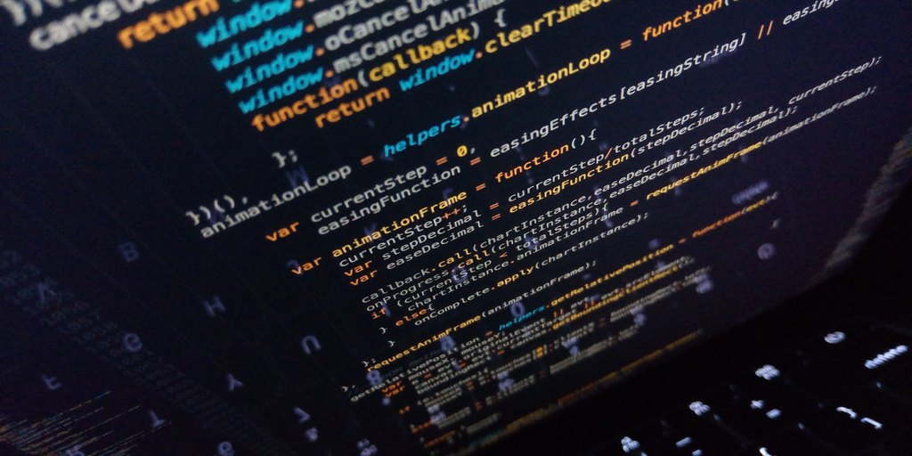

## Web Development

When undergrads ask me "Hey Joshua, how was ICS 314?", it will feel like reminiscing treading over dry desert under the scorching sun or traversing through the rocky waves of the North Sea. Even though those are not what I did, the steps closer to learning web development and finally building our own project was no easy task. In this class, we covered frontend with CSS and React, then backend with Prisma DB, and Auth. Under the hood we were practicing software engineering concepts such as open source, configuration management, agile project management, ethics, and more. The most important thing that came out from this was the skills that carry over to a different area than software engineering. Yes, this class was building skills for the real world as well! I'll be focusing on three concepts and how they relate to outside of ICS 314 and they are Open Source Software Development, Agile Project Management, and Ethics in Software Engineering.

## Software Skills in Version Control? That's Bonkers.

GitHub is a tool that beginner software engineers have heard of before team-oriented software engineering. The basic commands are 'git add .', 'git commit -m "message"', git status, git push. Then you level up by implementing 'git branch', 'git rebase', 'git merge', 'git push / pull origin main'. Therefore GitHub is a valuable tool in a software engineer's arsenal for version control. However, instead of using it as a log of code that you've forgotten about in the past, it's also crucial for seeing other people's code. This is what it means to contribute to Open Source Software.

Beyond Web Application Development, GitHub allows you to fork other people's code and contribute to it. Employers like this because they see that you're an active part of the coding realm. See a game repository that another person is working on? Press fork into repository and see what things you can learn from it.

## How about in Agile Teams?

We implemented Agile Project Management during the Final Project. In retrospect, it's imperative the Professor didn't allow people to work alone so that all students can experience what it's like to work as an agile team. An agile team works by meeting on set times referenced by a task board in order to build a product. This is the same idea as GitHub Projects for our group. We created projects called Milestones in order to keep track of the production cycle and what our team members are up to.

Beyond Web Development, this has great implications on working with a team, any team for that matter. Whether it's a design team, software engineering team, or a school team, it's imperative that there's a project management tool such as GitHub Actions, Jira, or Trello to record what everyone is doing and the progress of the project.

## How about Ethics?

Ethics in Software Engineering means keeping data secure. We did this with NextAuth.js where we had to use it to require people to sign up with their email and log in if they're a registered user. We implemented this feature in our final project not only for securement purposes but so that unauthenticated users can see sessions created by other University of Hawaii students. Besides security, it also means not stealing code and following professional standards, respecting laws, and accepting consequences for breaking them.

This Software Engineering Concept is important because ethics carry with you wherever you go. Throughout your life, in the workplace, and in relationships. We don't want to work with people who present their credibility in a bad way. If Ethics can be as vague as it sounds in Software Engineering, then it's as vague as it is beyond Web Development. For example, if working in an Agile team and you slack off, then lots of money and time is going to be wasted. The ethics in Software Engineering I reflects the ethics you have in the real-world experience.
