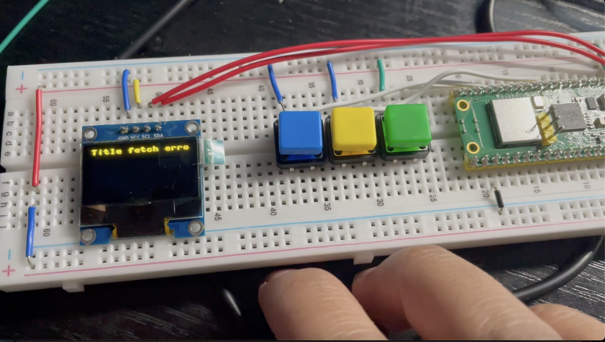

This is a self-made project where I used Thonny, Arch Linux, and hardware to build a simple MP3 player. The skills I improved in this project were micropython using Flask, client-server, as well as simple embedded systems. The downloaded MP3s were shared through a folder with Arch Linux to play the songs with the push of a button as shown on the image above.  
