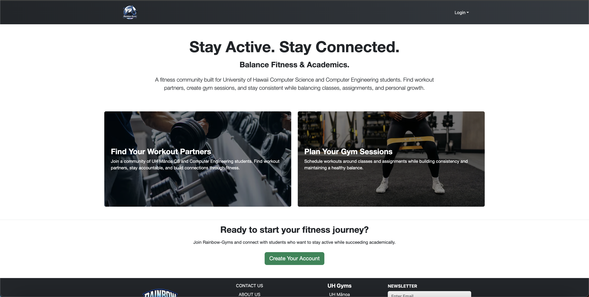
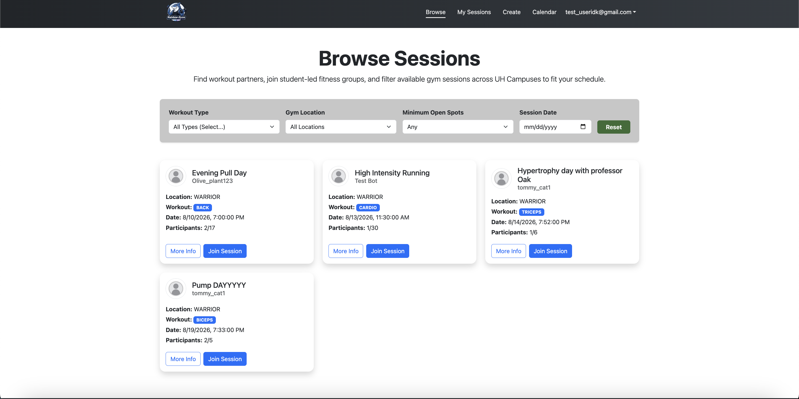
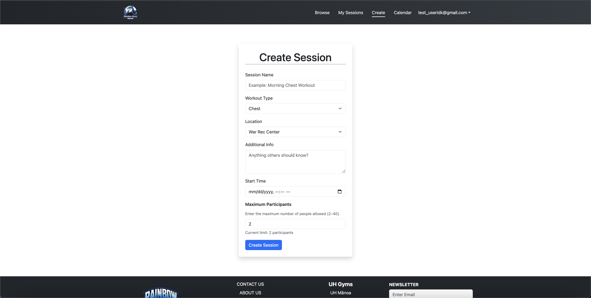
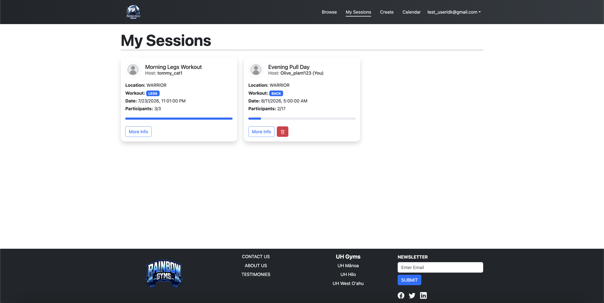

# Rainbow Gyms App

## Project Overview

Rainbow-Gyms is a fitness application designed for UH Mānoa Computer Science and Computer Engineering students. The goal of the application is to help students stay active while managing schoolwork and their personal lives. Many students spend long hours working on computers and may struggle to find time or motivation to go to the gym. Rainbow-Gyms helps solve this problem by making it easier to find workouts and workout partners.

The app is designed for students with beginner to intermediate fitness experience. It encourages students to stay consistent with their fitness goals while also connecting with other UH Mānoa students. The goal is to create a community where students can motivate each other and make fitness more enjoyable.

## My Contributions

My contributions focused on the design and development of the application. I helped create the user interface and worked on features related to workouts and finding workout partners. I also helped test the application and fix issues that came up during development.

I worked with my teammates through GitHub and helped keep our code organized. This allowed us to work on different parts of the application while keeping everything connected.

## What I Learned

This project taught me how to work on a larger software project with a team. I learned more about GitHub and how to manage code with branches and commits. I also learned how important communication is when multiple people are working on the same application.

Another thing I learned was the importance of designing an application around its users. We wanted Rainbow-Gyms to be simple and useful for busy college students. This helped me understand how software can solve real problems and improve people's daily lives.

## Screenshots

### Landing Page

### Browse Sessions Page

### Create Sessions Page

### My Sessions Page

## GitHub

The source code for Rainbow-Gyms can be found on the project's GitHub page:

[Rainbow-Gyms GitHub Organization](https://rainbow-gyms.github.io/)
